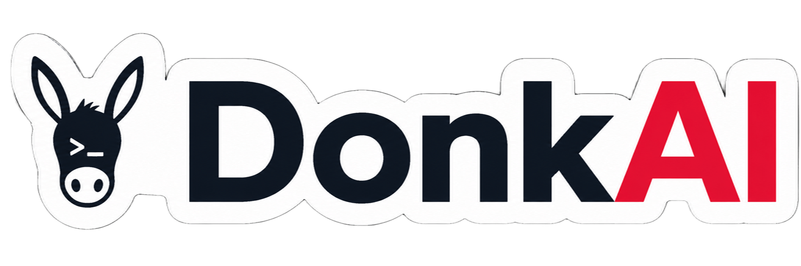

<p align="center">
  
</p>

> **Hands-on lab for the OWASP Top 10 for LLM Applications (2025)** - no real LLM required.

[](https://genai.owasp.org/llm-top-10/)

DonkAI is deliberately vulnerable web app you can run in one command and use to learn how LLM-integrated systems get broken by actually breaking them. Every OWASP LLM Top 10 category is represented by at least one playable challenge, with a written brief, a payload editor, an active defense to bypass, progressive hints, and a per-user history of every attempt. More than a fixed set of exercises, it's an extensible teaching lab: the modular architecture (one file per category, backend and frontend) makes it straightforward to add new vulnerabilities, harden existing defenses, or build entirely new tracks for workshops, courses, and CTFs.

> **Warning** this application intentionally exposes live attack surfaces (prompt injection, IDOR, SQL injection, hard-coded credentials, and more). It must be run only in an isolated lab environment, preferably inside a dedicated virtual machine, and must never be deployed on the open internet.

---

## Why this exists

The OWASP Top 10 for LLM Applications maps out the risks and gives the vocabulary for talking about them, essential reading for anyone working on LLM security. DonkAI is designed as a hands-on extension of that work: a small, deterministic playground where you **try** the attacks yourself, **see** them succeed against a fake-but-realistic chatbot, and read a debrief explaining what just worked and how a real system would defend against it. **There is no real LLM behind the curtain, the whole stack is rule-based,** so the lab is cheap, offline-friendly, and reproducible.

## Quick Start

Clone, build, and launch the full stack with two commands:

```bash
git clone https://github.com/OWASP/DonkAI.git && cd DonkAI
docker compose up --build
```

Then open **<http://localhost:3000>**, sign in with `alice / password123`, and pick your first challenge from the OWASP panel on the left.

### Services

| Service         | URL / Address                          |
|-----------------|----------------------------------------|
| Web UI          | <http://localhost:3000>                |
| Backend (API + docs) | <http://localhost:8000/docs>      |
| PostgreSQL      | `localhost:5432` — db `donk_ai_lab`    |

### Default Accounts

| Username | Password      | Role  |
|----------|---------------|-------|
| `alice`  | `password123` | user  |
| `bob`    | `password123` | user  |
| `admin`  | `admin123`    | admin |

> **Tip —** to wipe all state (users, sessions, attempt history) and start from a clean slate:
> ```bash
> docker compose down -v
> ```

---

## OWASP LLM Top 10 Coverage

Every category in the OWASP LLM Top 10 is represented by at least one playable challenge.

| #     | Category                          | Challenges | Backend file |
|-------|-----------------------------------|:----------:|--------------|
| LLM01 | Prompt Injection                  | 2          | [llm01_prompt_injection.py](ml-service/challenges/categories/llm01_prompt_injection.py) |
| LLM02 | Sensitive Info Disclosure         | 2          | [llm02_sensitive_info.py](ml-service/challenges/categories/llm02_sensitive_info.py) |
| LLM03 | Supply Chain                      | 1          | [llm03_supply_chain.py](ml-service/challenges/categories/llm03_supply_chain.py) |
| LLM04 | Data & Model Poisoning            | 1          | [llm04_data_poisoning.py](ml-service/challenges/categories/llm04_data_poisoning.py) |
| LLM05 | Improper Output Handling          | 2          | [llm05_improper_output.py](ml-service/challenges/categories/llm05_improper_output.py) |
| LLM06 | Excessive Agency                  | 2          | [llm06_excessive_agency.py](ml-service/challenges/categories/llm06_excessive_agency.py) |
| LLM07 | System Prompt Leakage             | 2          | [llm07_system_prompt_leak.py](ml-service/challenges/categories/llm07_system_prompt_leak.py) |
| LLM08 | Vector & Embedding Weaknesses     | 1          | [llm08_vector_weaknesses.py](ml-service/challenges/categories/llm08_vector_weaknesses.py) |
| LLM09 | Misinformation                    | 1          | [llm09_misinformation.py](ml-service/challenges/categories/llm09_misinformation.py) |
| LLM10 | Unbounded Consumption             | 1          | [llm10_unbounded_consumption.py](ml-service/challenges/categories/llm10_unbounded_consumption.py) |

---

## Architecture

```
   ┌──────────────────┐      ┌──────────────────┐      ┌────────────────┐
   │   React SPA      │ ───► │     FastAPI      │ ───► │   PostgreSQL   │
   │   :3000          │      │     :8000        │      │     :5432      │
   │   webapp/        │      │   ml-service/    │      │   database/    │
   └──────────────────┘      └──────────────────┘      └────────────────┘
```

| Layer        | Stack       | Role                                                                             |
|--------------|-------------|----------------------------------------------------------------------------------|
| **Frontend** | React       | Renders the challenge UI, payload editor, and per-attempt history drawer.        |
| **Backend**  | FastAPI     | One rule-based *challenge engine* per OWASP category - fully deterministic, no LLM calls. |
| **Database** | PostgreSQL  | Stores `users`, `chat_sessions`, `chat_messages`, `exploit_attempts` |

## Disclaimer

This application is **intentionally vulnerable**. The defaults (passwords, database credentials, hard-coded secrets in system prompts) are part of the educational content, not security oversights. Run locally or in an isolated lab, **never on a shared host or the public internet, and never against real production data.**

Only apply techniques you learn here against systems you own or have **explicit written permission** to test.
